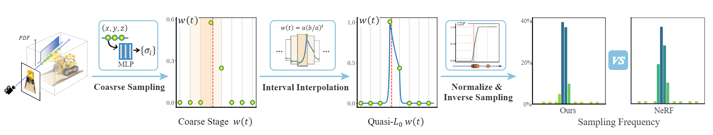
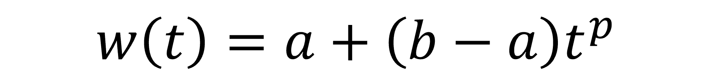

# L0-Sampler
<p align="center">
  
</p>

## [Project page](https://ustc3dv.github.io/L0-Sampler/)  |  [Paper](https://arxiv.org/abs/2311.07044)

This is the official repository for the implementation of **L0-Sampler: An L0 Model Guided Volume Sampling for NeRF**.

We present L0-Sampler, an upgrade of the Hierarchical Volume Sampling strategy of NeRF. Through the use of piecewise interpolation, we fit a quasi-L0 function, denoted as w(t), which closely resembles an indicator function capturing the L0 distance between points and surfaces. By normalizing this function, we create a probability density function (PDF) that effectively guides inverse transform sampling. By testing on different datasets, our proposed L0-Sampler with different NeRF frameworks can achieve stable performance improvements on rendering and reconstruction tasks with few lines of code modifications and around the same training time.
 
#### Only a few lines of code need to be changed from NeRF's HVS to ours:

```diff
  def sample_pdf(bins, weights, N_samples, det=False, pytest=False):
    # Maxblur
+   weights_pad = torch.cat([weights[..., :1], weights, weights[..., -1:]], axis=-1)
+   weights_max = torch.maximum(weights_pad[..., :-1], weights_pad[..., 1:])
+   weights = 0.5 * (weights_max[..., :-1] + weights_max[..., 1:])
    weights = weights + 1e-5 # prevent nans

    #Get integral
+   integral = (weights[..., 1:] - weights[..., :-1])/(torch.log(weights[..., 1:]/weights[..., :-1]) + 1e-6)

    # Get pdf
    pdf = integral / torch.sum(integral, -1, keepdim=True) # Here NeRF uses weights to normalize
    cdf = torch.cumsum(pdf, -1)
    cdf = torch.cat([torch.zeros_like(cdf[...,:1]), cdf], -1)

    # Take uniform samples
    if det:
        u = torch.linspace(0., 1., steps=N_samples)
        u = u.expand(list(cdf.shape[:-1]) + [N_samples])
    else:
        u = torch.rand(list(cdf.shape[:-1]) + [N_samples])

    # Invert CDF
    u = u.contiguous()
    inds = torch.searchsorted(cdf, u, right=True)
    below = torch.max(torch.zeros_like(inds-1), inds-1)
    above = torch.min((cdf.shape[-1]-1) * torch.ones_like(inds), inds)
    inds_g = torch.stack([below, above], -1)  # (batch, N_samples, 2)

    matched_shape = [inds_g.shape[0], inds_g.shape[1], cdf.shape[-1]]
    cdf_g = torch.gather(cdf.unsqueeze(1).expand(matched_shape), 2, inds_g)
    bins_g = torch.gather(bins.unsqueeze(1).expand(matched_shape), 2, inds_g)

-   denom = (cdf_g[...,1]-cdf_g[...,0])
-   denom = torch.where(denom<1e-5, torch.ones_like(denom), denom)
-   t = (u-cdf_g[...,0])/denom

    # Find Roots
+   residual = u-cdf_g[...,0]
+   rhs = residual * torch.sum(integral, dim = -1, keepdim = True)
+   weights_g = torch.gather(weights.unsqueeze(1).expand(matched_shape), 2, inds_g)
+   denom = torch.log(weights_g[..., 1]/weights_g[..., 0]) + 1e-6
+   t = torch.log1p(rhs*denom/weights_g[..., 0]) / denom

    samples = bins_g[...,0] + t * (bins_g[...,1]-bins_g[...,0])

    return samples
```
## Usage
Code is at `L0_sampler.py`. In that code, instead of using the simple version provided above, we have developed a a more comprehensive framework that allows users to easily select different interpolation functions. Our L0_sampler can be integrated into works that utilize importance sampling. We have successfully applied our L0-Sampler to several existing works, including:

[NeRF](https://github.com/kwea123/nerf_pl/tree/dev)

[Mip-NeRF](https://github.com/hjxwhy/mipnerf_pl)

[Torch-NGP](https://github.com/ashawkey/torch-ngp)

[NeRF++](https://github.com/Kai-46/nerfplusplus)

[NeuS](https://github.com/Totoro97/NeuS)

When utilizing our L0-sampler, you can easily integrate it into your project by downloading `L0_sampler.py`, and place it in the same directory where the sampling is performed. And at the beginning of the code, first import it like:

```
    from .L0_sampler import *
```

And then, take NeRF for example, replace
```
  z_samples = sample_pdf(z_vals_mid, weights[...,1:-1], N_importance, det=(perturb==0.), ...)
```
in the source code with
```
  z_samples = L0_sample_pdf(z_vals[..., 1:-1], weights[...,1:-1], N_importance, spline_type={spline_type}, det=(perturb==0.), blur=True, ...)
```
You can adjust the details according to the code.

Just remember to make the intervals and weights has the same size to interpolate properly. When setting `blur=True`, it implies the utilization of Maxblur strategy (see the paper for more details).

The `{spline_type}` can be choosen from: {`'linear'`, `'exp'`, `'inv'`, `'piecepoly'`, `'tpz'`, `'cubic'`, `'akima'`}. Their specific implementation can be found in the code. Here just list their defintions after interval transformation:

| Name | Full Name| Expression | Extra parameter |
| - | - | - | - |
| linear    | Linear    ||  |
| exp    | Exponential       ||   |
| inv    | Inverse       || ✓  |
| piecepoly    | Piecewise Polynomial || ✓  |
| tpz    | Trapezoid       || ✓  |
| cubic    | Cubic Spline    | -- |    |
| akima    | Akima Spline    | -- |    |

The definitions of cubic and Akima splines are a little complex and lengthy. Due to their intricate nature, we have opted not to include them here. However, rest assured that these definitions can be found in the relevant literature. Some other details can be found in our paper. 

## Citation

Cite as below if you find this repository is helpful to your project:

```
@article{li2023l0sampler,
      author    = {Li, Liangchen and Zhang, Juyong},
      title     = {$L_0$-Sampler: An $L_{0}$ Model Guided Volume Sampling for NeRF},
      journal   = {arXiv:2311.07044},
      year      = {2023},
  }
```


## Related Links
Thanks for the following works. They are helpful to our project:

The Modified Akima Interpolation in our framework is from [Matlab](https://www.mathworks.com/help/matlab/ref/makima.html).

[DDNeRF](https://github.com/dadonda89/DDNeRF) proposes another way to blur weights.

And we use the frameworks of [NeRF_pytorch](https://github.com/yenchenlin/nerf-pytorch), [NeRF_pl](https://github.com/kwea123/nerf_pl/tree/dev), [Mip-NeRF_pl](https://github.com/hjxwhy/mipnerf_pl), [Torch-NGP](https://github.com/ashawkey/torch-ngp), [NeRF++](https://github.com/Kai-46/nerfplusplus), [NeuS](https://github.com/Totoro97/NeuS). Most of them have been mentioned above.
